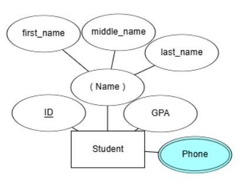

# Complete Tutorial on ER Diagrams

## What is an ER Diagram?

An **Entity-Relationship (ER) Diagram** is a visual representation used to model data in a database. It acts as a bridge between business requirements and the actual database schema implemented in a Database Management System (DBMS).

### Key Components of an ER Diagram:

1. **Entities**: Objects or concepts that we want to store information about.
2. **Attributes**: Specific pieces of information about entities.
3. **Relationships**: How entities interact with each other.
4. **Cardinality**: The number of instances of one entity related to another.
5. **Keys**: Unique identifiers for entities.
6. **Special Attributes and Entities**: Composite, multivalued, derived attributes, weak entities, etc.

Let’s dive into each component in detail.

## 1. Entities

An **entity** is any object or concept about which we want to store information. In an ER diagram, entities are represented by rectangles.

### Example:

For a school database, some entities might be:

- **Student**
- **Class**

## 2. Attributes

**Attributes** are specific details about an entity. They are represented by ovals connected to the entity.

### Example:

Attributes for the `Student` entity could include:

- **Name**
- **GPA**

#### Primary Key:

The **primary key** uniquely identifies each entry in the database table. It is underlined in the ER diagram.

### Composite Attributes:

These can be broken down into sub-attributes. For example, `Name` can be split into `First Name`, `Middle Name`, and `Last Name`.

### Multivalued Attributes:

Attributes that can have more than one value, like `Phone` a student belongs to. (Represented by double oval)

> `Phone` may has multiple values: `Home Phone`, `Mobile Phone`, `Work Phone`.

### Derived Attributes:

These are attributes that can be calculated from other attributes. For example, `Grade` can be derived from `GPA`. (Represented by dashed oval)

> `Grade` like `A`, `B`, `C` can be derived from `GPA`.

For example:

| GPA | Grade |
| --- | ----- |
| 4.0 | A     |
| 3.0 | B     |
| 2.0 | C     |

## 3. Relationships

A **relationship** shows how entities interact. Represented by diamonds, relationships often act as verbs connecting entities.

### Example:

A student **takes** a class.

### Participation Constraints:

- **Partial Participation**: Not all instances need to participate (single line). or using quantity like `0..1` or `0..*`. or using `o` for optional. (Optional)
- **Total Participation**: All instances must participate (double line). or using quantity like `1..1` or `1..*`. or using `|` for mandatory. (Mandatory)

> Not all students need to take a class, but all classes must be taken by at least one student.

> - A class must have at least one student.
> - A student may not be enrolled in any class.

- `Mandatory` -> `|` or `1..1` or `1..*` -> `must`, `have to`, `required`.
- `Optional` -> `o` or `0..1` or `0..*` -> `may`, `can`, `might`.

In the above, not all students need to take a class, but all classes must be taken by at least one student.

- `Partial Participation` for `Student` and `Total Participation` for `Class`.
- `Optional` for `Student` and `Mandatory` for `Class`.
- `0..*` for `Student` and `1..*` for `Class`.

### Relationship Attributes:

Attributes specific to a relationship, such as `Grade` a student receives in a class.

## 4. Cardinality

**Cardinality** defines the number of instances of one entity related to another.

### Types of Cardinalities:

- **One-to-One (1:1)**: One student takes one class, and one class is taken by one student.
- **One-to-Many (1:N)**: One student takes many classes, but each class is taken by one student.
- **Many-to-Many (M:N)**: Many students take many classes.

> - A student can take multiple classes.
> - A class can be taken by multiple students.

## 5. Weak Entities and Identifying Relationships

A **weak entity** cannot be uniquely identified by its attributes alone and depends on another entity.

### Example:

An `Exam` is a weak entity dependent on a `Class`.

- **Double Rectangle**: Represents a weak entity.
- **Double Diamond**: Represents an identifying relationship.

> - All exams must have a class, but not all classes need to have an exam.
> - Exam can't exist without a class.
> - Class may or may not have an exam.

## Final ER Diagram

## Constructing an ER Diagram

To create your own ER diagram, follow these steps:

1. Identify the main entities involved.
2. Define attributes for each entity, marking primary keys.
3. Establish relationships between entities.
4. Specify cardinalities and participation constraints.
5. Add any special attributes or entities as needed.

### Example Scenario:

Designing a school database:

1. **Entities**: Student, Class, Exam.
2. **Attributes**:
   - **Student**: Student ID, Name (First Name, Last Name), Grade Number, GPA, Clubs, Has Honors.
   - **Class**: Class ID.
   - **Exam**: Exam ID.
3. **Relationships**:
   - A student **takes** a class with a grade.
   - A class **has** exams.
4. **Cardinalities**:
   - A student can take multiple classes; a class can be taken by multiple students.
   - A class can have multiple exams; an exam belongs to one class.

## Conclusion

ER diagrams are powerful tools for designing databases. They allow you to visually map out entities, their attributes, and how they relate to each other. Understanding the symbols and conventions helps in translating business requirements into a structured database schema.
