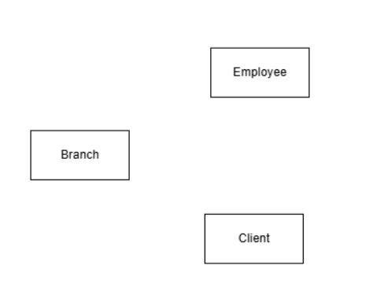
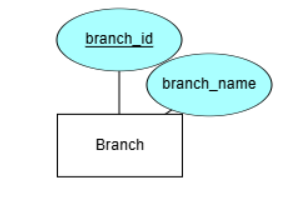
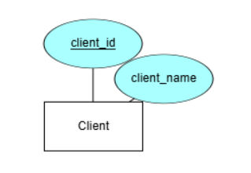
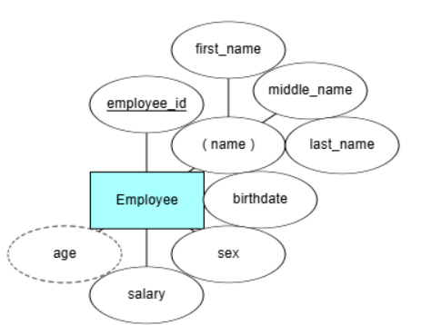
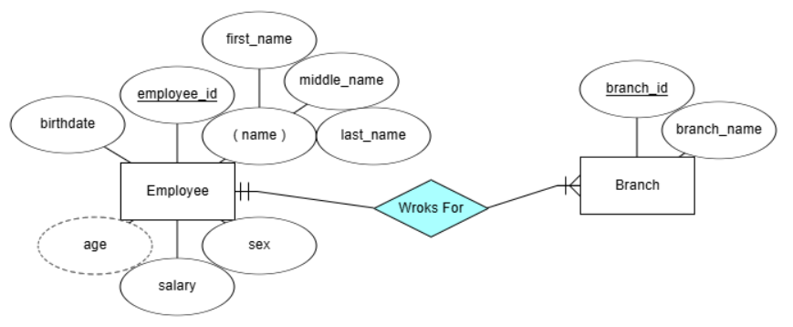
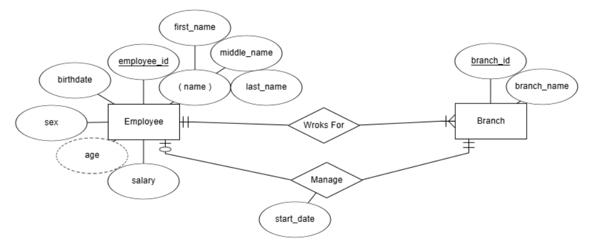
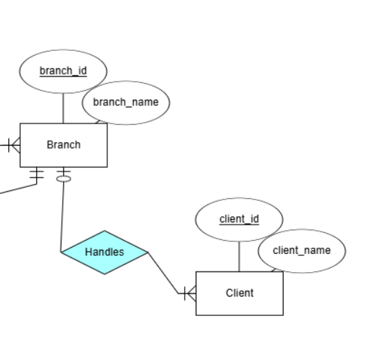
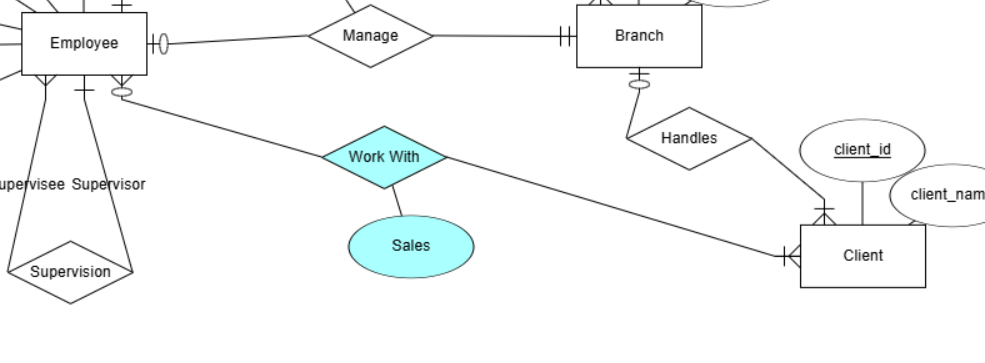
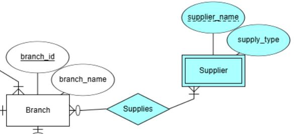
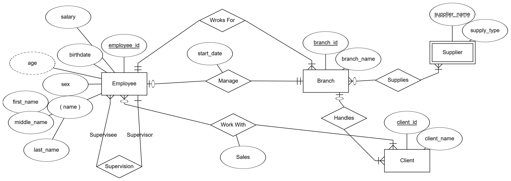

# Complete Tutorial on Creating an ER Diagram from Data Requirements

## What is an ER Diagram?

An **ER Diagram** is a visual representation used to model data in a database. It acts as a bridge between high-level business requirements and the actual database schema implemented in a Database Management System (DBMS).

### Why Use an ER Diagram?

- **Organizes Data**: Helps in organizing data into entities, attributes, and relationships.
- **Defines Relationships**: Clearly shows how different entities interact.
- **Guides Schema Design**: Makes it easier to convert into a database schema.

## Steps to Create an ER Diagram

Let’s walk through the process of creating an ER diagram using a sample **Company Data Requirements** document.

The company is organized into `branches`. Each branch has a `unique number`, a `name`, and a designated `employee` who `manages` it.

The company generates revenue by selling to `clients`. Each client has a `name` and a `unique number` for identification.

The foundation of the company is its employees. Each employee has a `name`, `birthdate`, `sex`, `salary`, and a `unique number`. An employee can `work` for `only one branch` at a time, and each branch is `managed` by `one` of its employees. We also want to keep track of `when the current manager started` their managerial role.

An employee can act as a `supervisor` for other employees within the same branch. Additionally, an employee may also supervise employees at other branches. However, an employee can have at most `one supervisor`.

A branch may `handle` `multiple clients`, with each client having a `name` and a `unique number` for identification. A `single` client may only be handled by `one` branch at a time.

Employees can work with clients managed by their branch to facilitate sales. If necessary, `multiple` employees can collaborate with the same client. We want to keep track of the `total sales` (in dollars) that each employee generates for each client they work with.

Many branches will need to collaborate with `suppliers` to procure inventory. For each supplier, we will record their `name` and the `type of product` they supply. A `single` supplier may provide products to `multiple` branches.

### Step 1: Identify Entities

Entities are objects or concepts about which we want to store information. They are represented by rectangles.

From the document:

- **Branch**
- **Client**
- **Employee**

### Step 2: Define Attributes

Attributes are specific pieces of information about entities. They are represented by ovals connected to the entity.

#### **Branch**:

The company is organized into **branches**. Each branch has a **unique number**, and a **name**.

- **Branch ID** (Primary Key)
- **Branch Name**

#### **Client**:

The company generates revenue by selling to **clients**. Each client has a **name** and a **unique number** for identification.

- **Client ID** (Primary Key)
- **Client Name**

#### **Employee**:

The foundation of the company is its **employees**. Each employee has a **name**, **birthdate**, **sex**, **salary**, and a **unique number**.

- **Employee ID** (Primary Key)
- **Name** (Composite Attribute: First Name, Middle Name, Last Name)
- **Birthday**
- **Sex**
- **Salary**
- **Age** (Derived Attribute from Birthday)

### Step 3: Establish Relationships

Relationships show how entities interact. They are represented by diamonds.

#### **Works For**

An employee can work for only one branch at a time.

All Branches must have employees (total participation); all employees must work for a branch (total participation).

`|` in the side of the employee; `|` in the side of the branch.

Branch can have any number of employees; an employee can work for one branch.

`M` in the side of the employee; `1` in the side of the branch.

#### **Manages**

Each branch is managed by one of its employees, we'll keep track of when the current manager started their managerial role.

All branches must have a manager (total participation); not all employees need to manage a branch (partial participation).

`o` in the side of the employee; `|` in the side of the branch.

each branch can be managed by one employee; an employee can manage one branch.

`1` in the side of the employee; `1` in the side of the branch.

we have to add an attribute to the relationship to keep track of the start date. `Start Date`

> - `o` means optional or partial participation or we can use `one line`
> - `|` means mandatory or total participation. or we can use `two lines`

#### **Supervision**

An employee can act as a supervisor for other employees within the same branch. Additionally, an employee may also supervise employees at other branches. However, an employee can have at most one supervisor.

> can/may means optional or partial participation; must means mandatory or total participation.

`o` in the two sides of the employee.

An employee can supervise any number of employees; an employee can be supervised by one employee.

`M` in the side of the employee; `1` in the side of the employee.

#### **Handles**

A branch may handle multiple clients, A single client may only be handled by one branch at a time.

Not all branches need to handle clients (partial participation); all clients must be handled by a branch (total participation).

`|` in the side of the branch; `|` in the side of the client.

A branch can handle any number of clients; a client can be handled by one branch.

`M` in the side of the branch; `1` in the side of the client.

Explanation of using [ERDPlus](https://erdplus.com/) to create an ERD.

#### **Works With**

An employee can work with clients managed by their branch to facilitate sales. If necessary, multiple employees can collaborate with the same client.

We want to keep track of the total sales (in dollars) that each employee generates for each client they work with.

Not all employees need to work with clients (partial participation); all clients must work with employees (total participation).

`o` in the side of the employee; `|` in the side of the client.

An employee can work with any number of clients; a client can work with any number of employees.

`M` in the side of the employee; `M` in the side of the client.

we have to add an attribute to the relationship to keep track of the sales amount. `Sales Amount`

### Step 4: Specify Cardinality and Participation

We have already specified the cardinality and participation for each relationship in the previous step.

### Step 5: Add Relationship Attributes

We have already added relationship attributes for relationships that require them.

### Step 6: Incorporate Weak Entities and Identifying Relationships

Weak entities depend on another entity for their existence.

#### **Branch Supplier** is a weak entity dependent on **Branch**.

A branch may need to collaborate with suppliers to procure inventory. For each supplier, we will record their name and the type of product they supply. A single supplier may provide products to multiple branches.

A supplier is a weak entity because it cannot exist without a branch to supply to.

A branch can have multiple suppliers; a supplier can supply to multiple branches.

`M` in the side of the branch; `M` in the side of the supplier.

Branch in mandatory; supplier is optional.

- **Attributes** for **Branch Supplier**:
  - **Supplier Name**
  - **Supply Type**

## Constructing the Final ER Diagram

Putting it all together, here’s what the final ER diagram might look like:

## Conclusion

Creating an ER diagram involves identifying entities, defining attributes, establishing relationships, specifying cardinality and participation, adding relationship attributes, and incorporating weak entities and identifying relationships. By following these steps, you can effectively translate business requirements into a structured database schema.
